# 基于springboot的桂林旅游景点导游平台

#### 介绍

桂林旅游景点导游平台是一个基于Spring Boot框架开发的综合性旅游服务平台。该平台旨在为游客提供全面的桂林旅游景点信息、线路推荐、预订服务及交流互动等功能，同时，也为管理员提供便捷的用户管理、景点信息管理、预订信息处理等后台管理工具。通过该平台，游客可以方便地获取最新的旅游资讯，制定个性化的旅游计划，享受一站式的旅游服务；管理员则可以高效地进行信息更新和维护，确保平台服务的及时性和准确性。

#### 技术栈

后端技术栈：Springboot+Mysql+Maven

前端技术栈：Vue+Html+Css+Javascript+ElementUI

开发工具：Idea+Vscode+Navicate

#### 系统功能介绍

管理员角色功能模块  
个人中心：管理员可以登录平台，查看个人信息、修改密码等。  
用户管理：管理员可以查看所有用户信息，进行用户添加、修改、删除等操作，确保用户信息的准确性和安全性。  
景点类型管理：根据桂林旅游资源的实际情况，管理员可以添加、修改、删除景点类型，方便游客按类型查找景点。  
景点信息管理：管理员可以添加、修改、删除景点信息，包括景点名称、图片、介绍等，确保景点信息的准确性和完整性。  
线路推荐管理：管理员可以根据游客需求和旅游资源，制定并发布线路推荐信息，为游客提供个性化的旅游建议。  
预订信息管理：管理员可以查看游客的预订信息，进行订单处理、确认等操作，确保预订服务的顺利进行。  
论坛交流：管理员可以在论坛中发布旅游信息、活动通知等，同时管理论坛的秩序和氛围。  
系统管理：管理员可以对系统进行配置、备份、恢复等操作，确保系统的稳定运行和数据安全。  
用户角色功能模块  
景点信息：用户可以浏览各类景点信息，查看景点图片、介绍等，为旅游规划提供参考。  
线路推荐：用户可以查看管理员发布的线路推荐信息，根据自己的兴趣和时间选择适合的旅游线路。  
论坛交流：用户可以在论坛中发布旅游心得、提问、回答等，与其他游客和管理员进行交流互动。  
新闻资讯：用户可以查看最新的旅游新闻、活动信息等，了解桂林旅游的最新动态。  
个人中心：用户可以登录平台，查看个人信息、修改密码、管理预订订单等。  
后台管理（特定用户权限）：部分用户可能拥有后台管理权限，如景点信息管理、线路推荐管理、预订信息管理等，以便更好地参与平台的建设和管理。  

#### 系统作用

为游客提供便利  
用户能够轻松获取桂林旅游景点的全面信息，规划个性化的旅游线路。  
在线预订功能节省了游客的时间和精力，提升了旅游的便捷性。  
论坛交流和新闻资讯使用户可以分享经验、获取最新动态，更好地准备旅行。  
提升旅游管理效率  
管理员能够高效地管理景点信息、用户数据和预订订单，优化旅游资源配置。  
线路推荐管理和景点类型管理有助于打造更具吸引力的旅游产品。  
系统管理功能保障了平台的稳定运行和数据安全。  
促进桂林旅游业发展  
丰富的功能和优质的服务能够吸引更多游客前往桂林，推动旅游业的繁荣。  
游客的反馈和评价有助于提升桂林旅游的服务质量和品牌形象。  

#### 系统功能截图

代码结构

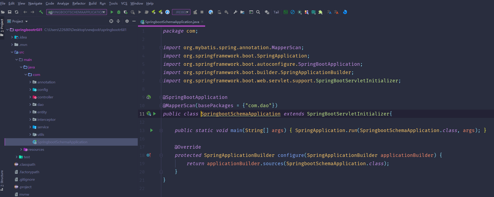

数据库表

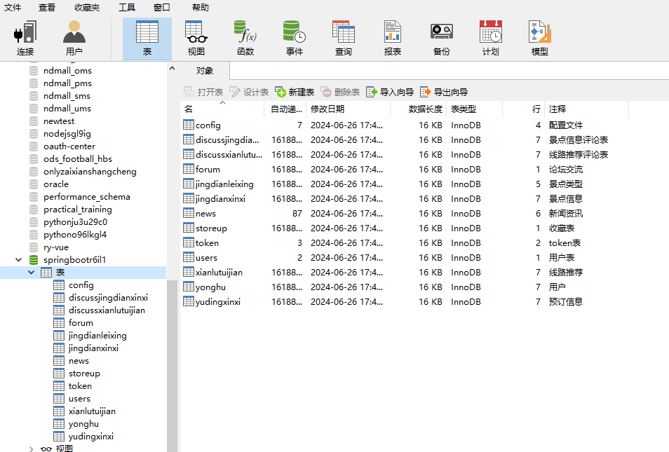

登录

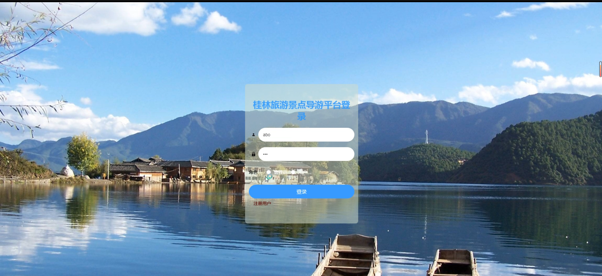

用户管理

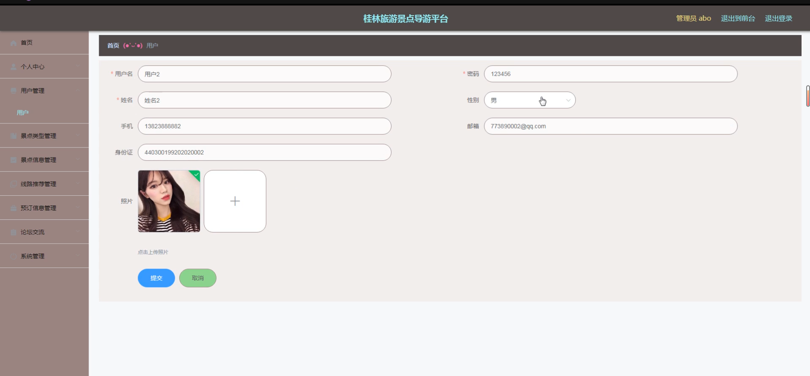

景点类型管理

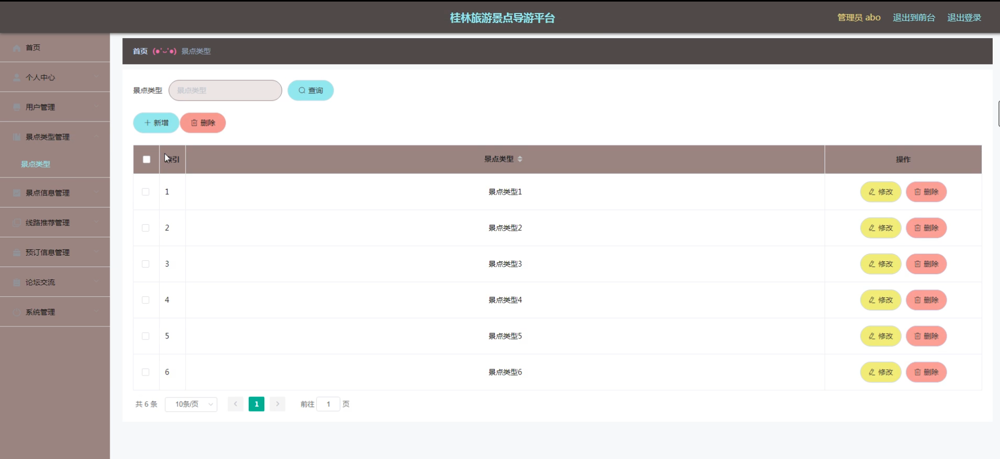

景点信息管理

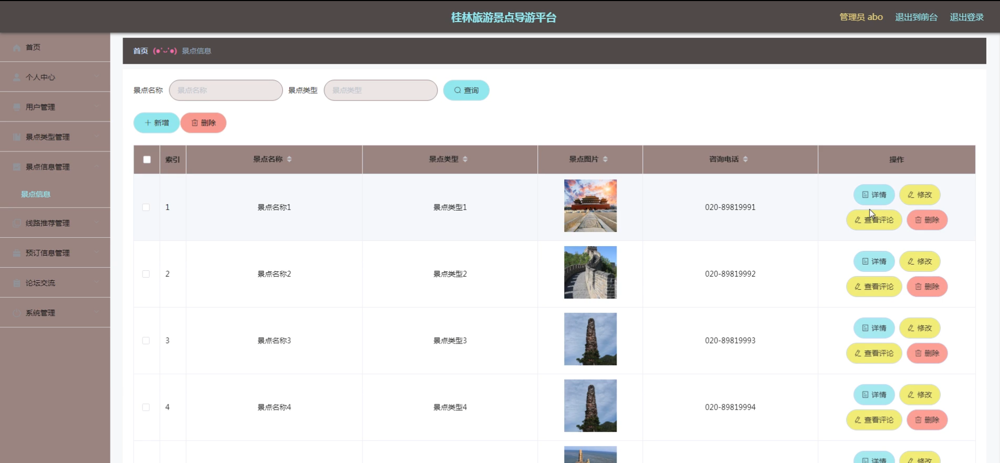

路线推荐管理

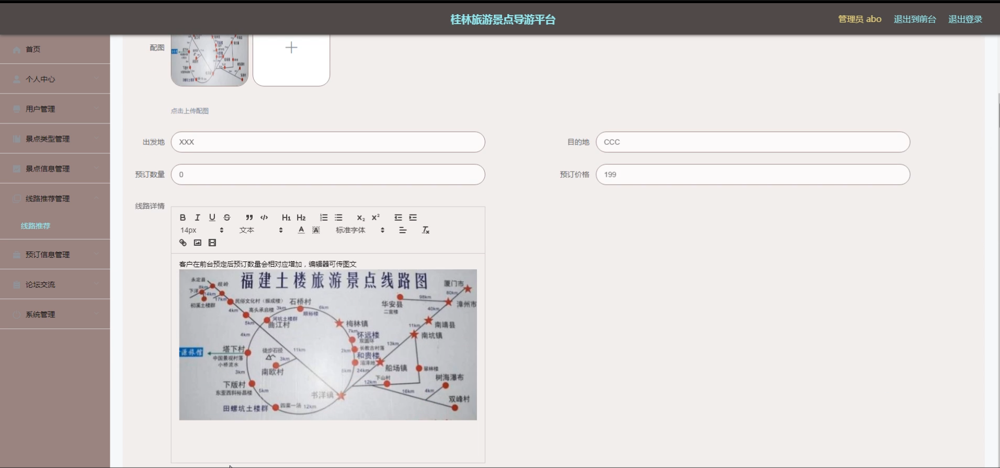

预定信息管理

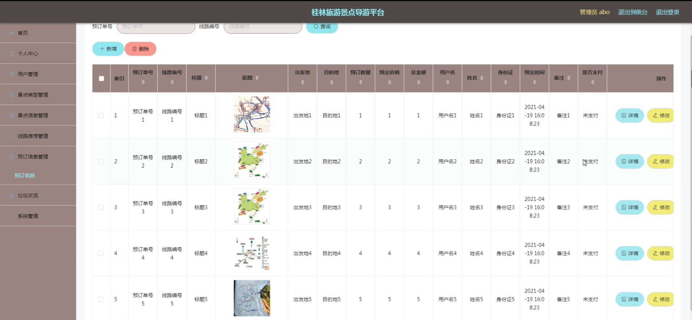

论坛交流

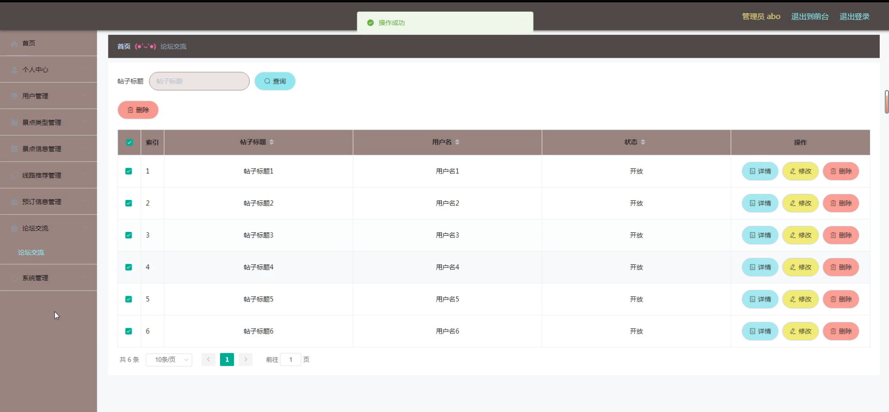

系统管理

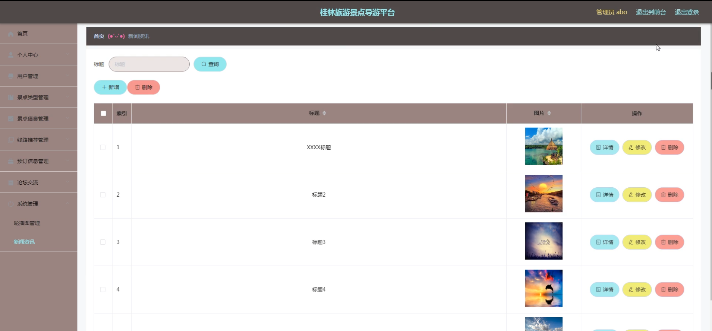

前台页面首页

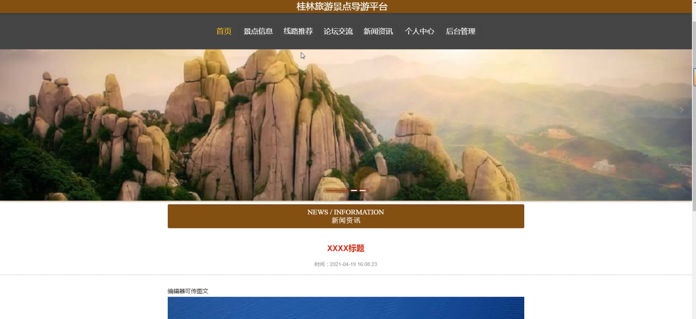

个人中心

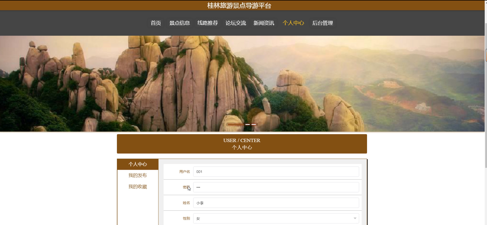

用户端后台管理

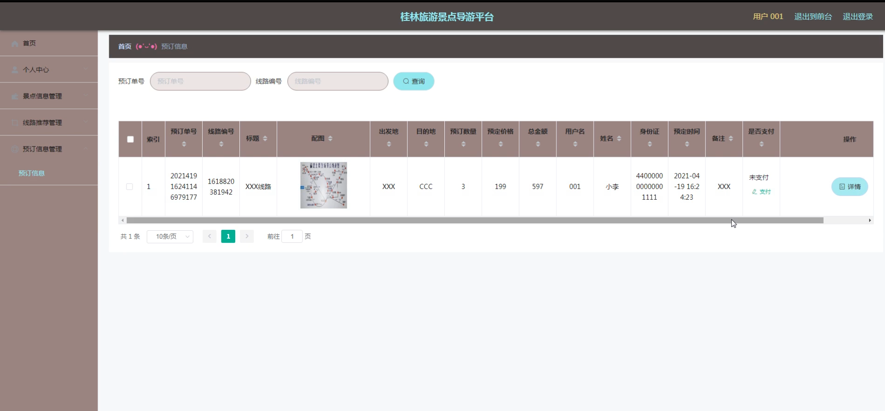

#### 总结

桂林旅游景点导游平台是一个集旅游服务和管理于一体的综合性平台。通过该平台，游客可以方便地获取最新的旅游资讯和个性化的旅游建议；管理员可以高效地进行信息更新和维护，确保平台服务的及时性和准确性。该平台不仅提升了游客的旅游体验和管理员的工作效率，也促进了游客与管理员之间的互动和沟通，为桂林旅游事业的发展做出了积极贡献。

#### 使用说明

创建数据库，执行数据库脚本 修改jdbc数据库连接参数 下载安装maven依赖jar 启动idea中的springboot项目

后台地址：http://localhost:8080/springbootr6il1/admin/dist/index.html

管理员  abo 密码 abo

前台地址：http://localhost:8080/springbootr6il1/front/index.html

